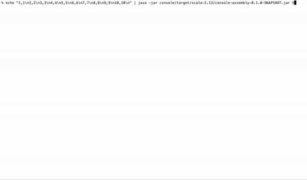

```console
% sbt "clean;console/assembly"
% java -jar console/target/scala-2.13/console-assembly-0.1.0-SNAPSHOT.jar
input timestamp, price pairs separated by newlines, e.g. 1,100\n2,110
1,1
2,2
3,3
4,4
OHLC(o=1,h=4,l=1,c=4,period=[0,5),interval=5)
5,5
6,6
7,7
8,8
OHLC(o=5,h=8,l=5,c=8,period=[5,10),interval=5)
10,10
OHLC(o=10,h=10,l=10,c=10,period=[10,15),interval=5)
```
